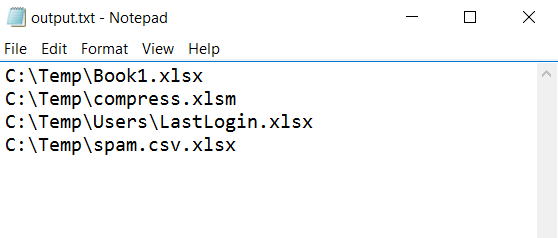
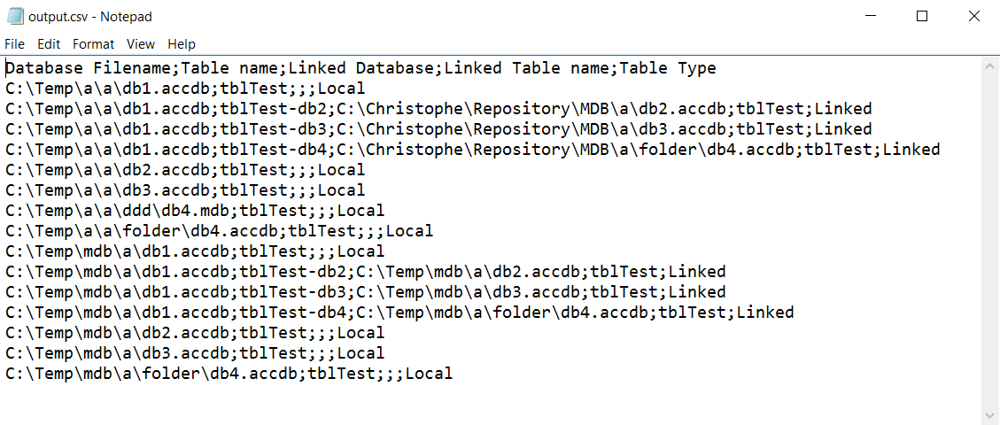

# Windows - Script utilities

This repository contains VBS classes that will help Windows users to collect a list of files based on extensions (see `classes/ScanFolder.vbs`) and utilities to work with MS Access databases (see `classes/MSAccess.vbs`)

## classes/ScanFolder.vbs

ScanFolder is aiming to scan recursively a folder and search for f.i. text files (`.txt`, `.csv`, `.md`, ...), Excel files (`.xlsx`, `.xlam`, ...), collect the list of filenames and output them in a text file so that file can be used by an another business logic.

The output will be something like :



See [test/retrieve_excel.vbs](test/retrieve_excel.vbs) for an example.

## classes/MSAccess.vbs

Provide functionnalities for working with MS Access databases.

### MS Access - Get list of tables in databases

See [test/retrieve_access.vbs](test/retrieve_access.vbs) for an example.



Below an example that will display the list of tables in a specific database.
Only external tables (`linked table`) will be retrieved and displayed.

```VB
Dim cMSAccess
Dim arrDBNames(0)

	Set cMSAccess = New clsMSAccess

	' Make sure that file exists and is accessible
	arrDBNames(0) = "C:\Temp\db1.accdb"
	
	' Retrieve the list of tables and echo it (true : only attached tables)
	wScript.Echo cMSAccess.GetListOfTables(arrDBNames, true)

	Set cMSAccess = Nothing
```    

### MS Access - Remove a prefix (like "dbo_")

See [test/access_remove_prefix.vbs](test/access_remove_prefix.vbs) for an example.

The Microsoft SQL Server upsize wizard migrate tables to SQL server and add automatically the `dbo_` prefix.  The `RemovePrefix()` function is aimed to remove that prefix.

```VB
	Set cMSAccess = New clsMSAccess
	cMSAccess.Verbose = True
	arrDBNames(0) = "C:\Temp\db1.accdb"
	Call cMSAccess.RemovePrefix(arrDBNames, "dbo_")
	Set cMSAccess = Nothing
```

### MS Access - Decompose

See [test/access_decompose.vbs](test/access_decompose.vbs) for an example.

Automate the extraction of any VBA code in a database (i.e. in `forms`, `macros`, `modules` and `reports`) and export them in a `/src` file where the database is stored

```VB
	Set cMSAccess = New clsMSAccess
	cMSAccess.Verbose = True
	arrDBNames(0) = "C:\Temp\db1.accdb"
	Call cMSAccess.Decompose(arrDBNames, "")
	Set cMSAccess = Nothing
```

By calling this code, you'll get, for instance : 

```text
Process database C:\Temp\db1.accdb
	Export module getFigures to C:\Temp\db1_accdb\src\Modules\getFigures.txt
	Export module Helper to C:\Temp\db1_accdb\src\Modules\Helper.txt
	Export module Constants to C:\Temp\db1_accdb\src\Modules\Constants.txt
	Export module clsWindows to C:\Temp\db1_accdb\src\Modules\clsWindows.txt
	Export module clsFolder to C:\Temp\db1_accdb\src\Modules\clsFolder.txt
	Export module clsFile to C:\Temp\db1_accdb\src\Modules\clsFile.txt
	Export macro getFigures to C:\Temp\db1_accdb\src\Macros\getFigures.txt
```

### MS Access - GetFieldsList

See [test/access_fields_list.vbs](test/access_fields_list.vbs) for an example.

Open a database, get the list of tables and for each of them, get the list of fields and a few properties like the type, the size, the shortest and longest value size (for text and memo fields)

```VB
	Set cMSAccess = New clsMSAccess
	cMSAccess.Verbose = True
	arrDBNames(0) = "C:\Temp\db1.accdb"
	wScript.echo cMSAccess.GetFieldsList(arrDBNames)
	Set cMSAccess = Nothing
```

By calling this code, you'll get, for instance : 

```text
Database;TableName;FieldName;FieldType;FieldSize;ShortestSize;LongestSize
C:\Temp\db1.accdb;Bistel;RefDate;Date/Time;8;;
C:\Temp\db1.accdb;Bistel;BudgetType;Byte;1;;
C:\Temp\db1.accdb;Bistel;OrganicDivision;Text (fixed width);2;;
C:\Temp\db1.accdb;Bistel;Program;Text (fixed width);1;;
C:\Temp\db1.accdb;Bistel;Published;Yes/No;1;;
C:\Temp\db1.accdb;Bistel;DescriptionDutch;Text;50;10;48
C:\Temp\db1.accdb;Bistel;DescriptionFrench;Text;50;0;50
C:\Temp\db1.accdb;Bistel;Article;Text;6;6;6
C:\Temp\db1.accdb;departements;bud;Text;255;2;2
```